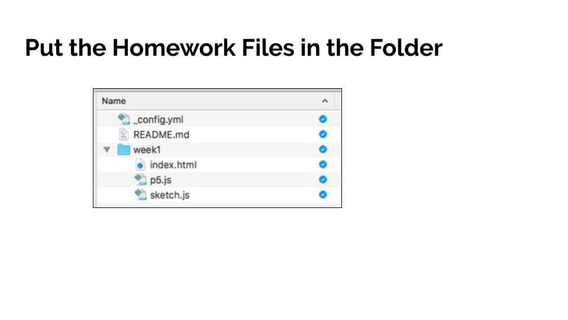
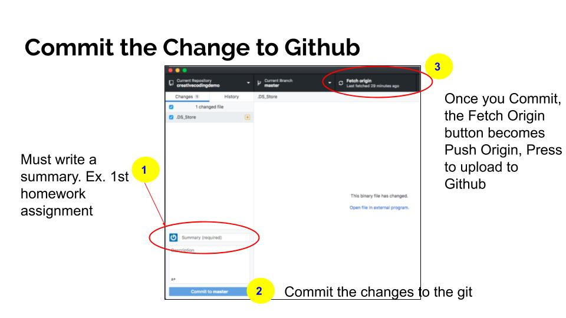
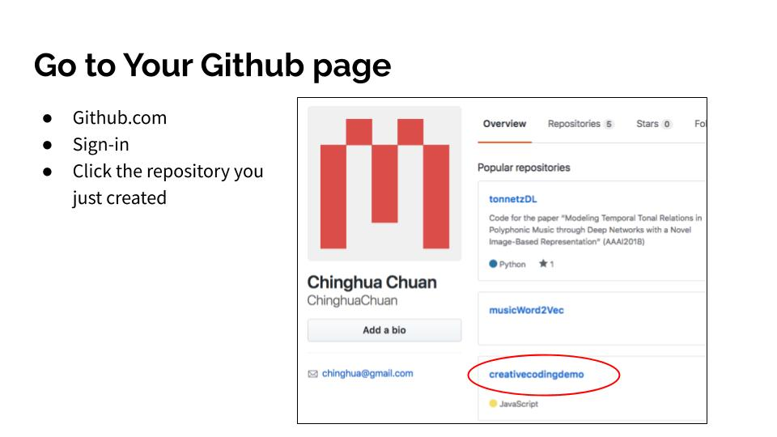
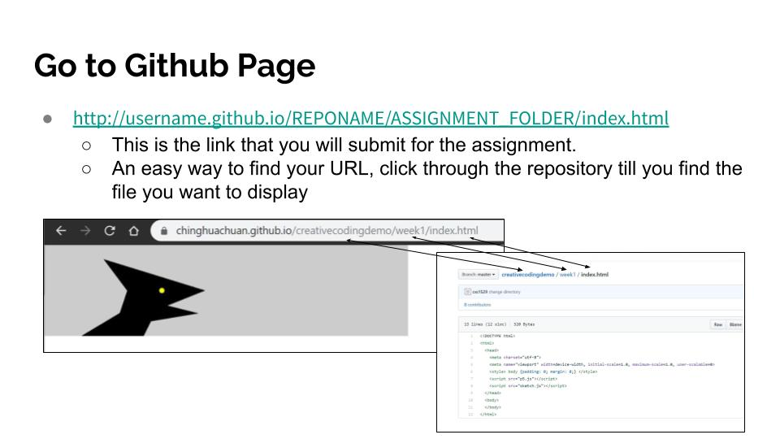
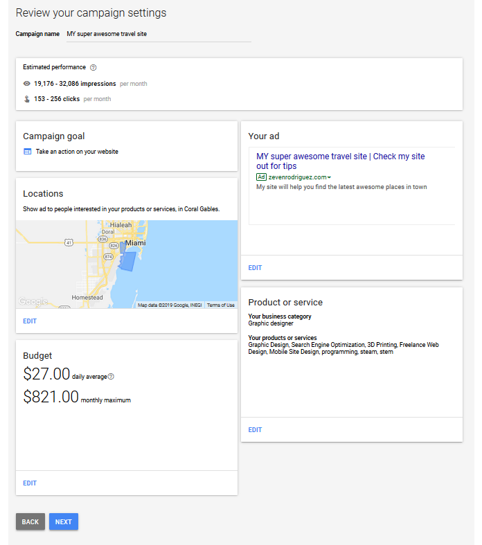

# Assignments

## Uploading HW to Github

Using the repository we created in class.

**If you make any additional changes please make sure to save and upload your assignment again**

## HTML/Resume Assignment

Build a page with your information from your résumé. Your page must have the following content:

* Your name should be at the top of the page as an `<h1></h1>` heading.
* Use heading tags for all your section heads.
* Write a paragraph about yourself.
* Add a photograph of yourself
* Add Work Experience
* A list of hobbies or interests displayed as an HTML ordered or unordered list.

**If you do not have a resume look at examples to format and have the right information.**

### Grading
|                                                            | Points |
|------------------------------------------------------------|--------|
| Proper html document setup                                 |  10    |
| Use meta author and description tags                       | 10     |
| Use heading tags for your different sections               | 10     |
| Add an HTML comment                                        | 5      |
| Use the address tag (You can use a fake or school address) | 10     |
| Create a table                                             |  10    |
| Include an ordered or unordered list                       | 10     |
| Include 2 links                                            | 10     |
| Use the bold or italics tags twice                         | 10     |
| Include at least one image                                 | 10     |
| Resume styling                                             | 5      |
| **Total Points**                                             | 100      |

### Turning assignment in

Create a `resume` folder. Place an `index.html` file in the folder. Place your code in that file. Create an `images` folder in your `resume` folder. Please link your `resume` folder on the `index.html` file in your hw folder.

#### Folder Structure

* resume (folder)
  * index.html (file)
 * images (folder)

## HTML/CSS Assignment

Style your résumé using CSS styling elements.

### Grading
|                                                                                                                                                                                         | Points |
|-----------------------------------------------------------------------------------------------------------------------------------------------------------------------------------------|--------|
| Style 2 links: <ul><li>Set the color of the links and remove the underline</li><li>Style `:hover` effect.</li></ul>| 20     |
| Use at least one custom font                                                                                                                                                            |  10    |
| Use an external stylesheet for your css with the `<link>` tag                                                                                                                           | 10     |
| Style 2 elements (ex: `p`, `address`, `h1`, `b`)                                                                                                                                        | 10     |
| Create and use 5 id                                                                                                                                                                     | 25     |
| Create and use 2 classes more than once                                                                                                                                                 | 20     |
| Explore a new CSS Property: Find a property from this [list](https://developer.mozilla.org/en-US/docs/Web/CSS/Reference), Mozilla CSS Reference, and use it in at least one id or class |        |
| Validate your [html](https://validator.w3.org/) and [css](https://jigsaw.w3.org/css-validator/)                                                                                        | 5      |
| **Total Points** | 100      |

## Responsive Site

Choose a hobby, cause, or topic you might be interested in and create a personal site. You will need to use CSS grid and media queries to make the site dynamic with a desktop and a mobile view. HTML and CSS code should be valid.

### Grading
|                                                                                                                          | Points |
|--------------------------------------------------------------------------------------------------------------------------|--------|
|  Desktop and Mobile Layouts:<ul><li>External stylesheet for each view</li><li>Styling for each layout</li></ul>          | 80     |
| Desktop and Mobile Navigation                                                                                            | 40     |
| Four different multi-row or multi-column grid content sections. (ex: picture gallery, multi-column text, text and image) | 60     |
| HTML: <ul><li>Use the `header`, `main`, and `footer` tags</li><li>Style page appropriately</li>                          | 10     |
| Create a wireframe or design drawing of your site                                                                        | 10     |
| **Total Points** | 100    |

## jQuery Assignment Part A

Choose from one of the two options:

1. **How-to Website**: Create a recipe page, or how to make something like an origami crane or a painting. Include ingredients, directions, tips, etc.
1. **Vacation Website**: Create a vacation website based on a place you have visited before. Include images, locations, tips, and places to visit.

Your page should have a minimum of 5 steps or locations. Use images or video. Use organizational tags and CSS to organize and style your page.

Use jQuery to show and hide steps or images. You can use tabs example to cycle through different steps. You can also use the .html() or .css() function to change or augment your html.

### Grading

This is the minimum number of things you must include on your site:

|                                                         | Points |
|---------------------------------------------------------|--------|
| 3 `.click()`, `.mouseover()`, or `.mouseleave()` events | 60     |
| 1 `.show()`, `.hide()`, or `.toggle()` event            | 10     |
| 1 `.html()`                                             | 10     |
| 1 `.css()`                                              | 10     |
| Minimum of 5 Images                                     | 10     |
| Use the `<header>` tag                                  | 5      |
| Intro paragraph                                         | 5      |
| A 5-item list                                          | 5      |
| Use CSS creatively to make your site presentable        | 25     |
| **Total Points**                                        | 140    |

## jQuery Assignment Part B

Choose and implement a jQuery plugin. You must apply the plugin on a minimum of 5 elements or areas on your site.

### Grading

|                                                        | Points |
|--------------------------------------------------------|--------|
| Successfully installing/using jQuery Plugin            | 10     |
| Use plugin on a minimum of 5 elements or areas on page | 50     |
| **Total Points**                                       | 60     |

## FINAL PROJECT

Create a website for a portfolio, a story, or on a subject you care deeply about. Along with your website you will submit sketches/wireframes, a creative brief, and an online marketing and SEO plan. You should also include links to **5** websites that served as inspiration for your work.

### Creative Brief

In the best cases, a creative brief is a document created through initial meetings, interviews, readings and discussions between a client and designer before any work begins. Throughout the project, the creative brief continues to inform and guide the work. A good creative brief will answer these questions:

* What is this project?
* Who is it for?
* Why are we doing it?
* What needs to be done? By whom? By when?
* Where and how will it be used?

[The 10 most important things to include in a creative brief](https://www.mohawkconnects.com/feltandwire/2011/02/08/the-creative-brief-10-things-it-must-include/)

1. Background Summary: Who is the client? What is the product or service? What are the strengths, weaknesses, opportunities and threats (or SWOTs) involved with this product or service? Are there existing research, reports and other documents that help you understand the situation?
2. Overview: What is the project? What are we designing and why? Why do we need this project? What’s the opportunity?
3. Drivers: What is our goal for this project? What are we trying to achieve? What is the purpose of our work? What are our top three objectives?
4. Audience: Who are we talking to? What do they think of us? Why should they care?
5. Competitors: Who is the competition? What are they telling the audience that we should be telling them? SWOT analysis on them? What differentiates us from them?
6. Tone: How should we be communicating? What adjectives describe the feeling or approach?
7. Message: What are we saying with this piece exactly? Are the words already developed or do we need to develop them? What do we want audiences to take away?
8. Visuals: Are we developing new images or picking up existing ones? If we are creating them, who/what/where are we photographing or illustrating? And why?
9. Details: Any mandatory information that must be included? List of deliverables? Preconceived ideas? Format parameters? Limitations and restrictions? Timeline, schedule, budget?
10. People: Who are we reporting to? Who exactly is approving this work? Who needs to be informed of our progress? By what means?

### Wireframes

Create simple layouts for each distinct pages, scan or take pictures of your designs and place them in your project folder.

### Online marketing and SEO plan

Come up with a marketing plan for your website. Your goal is to promote your website. Using a budget of $1000, explain your business rationale. Choose either [twitter](https://ads.twitter.com/), [google adwords](https://ads.google.com/home/), or [facebook](https://www.facebook.com/business/) to create your campaign.

The following questions are a good guide for creating your plan. Please turn this part in as a PDF or Word document.

* What areas/locations are you target and why?
* List what keywords are you going to use and buy?
* What is the duration of your campaign? Try to explain your reasoning on the duration. Is there an event, etc?.
* Include screenshots of your campaign

### Google Analytics

Add the Google Analytics script tag to your `index.html` file.

### Grading

|                                                                                                                                                                                                                                                                                                                          | Points |
|--------------------------------------------------------------------------------------------------------------------------------------------------------------------------------------------------------------------------------------------------------------------------------------------------------------------------|--------|
| Creative Brief                                                                                                                                                                                                                                                                                                           | 25     |
| Wireframes                                                                                                                                                                                                                                                                                                               | 25     |
| Online marketing and SEO plan                                                                                                                                                                                                                                                                                            | 25     |
| Google Analytics                                                                                                                                                                                                                                                                                                         | 25     |
|  Deploying/Presenting final website:<ul><li>You must include a minimum of 3 grid sections</li><li>You must have either a 4-page site, or 1 page with 6 information sections</li></ul>                                                                                                                                 | 50     |
| Responsiveness: <ul><li>Use media queries</li><li>Desktop and Mobile layouts</li><li>Use CSS grid</li></ul>                                                                                                                                                                                                              | 100    |
| jQuery: Use jQuery functions and plugins to add thoughtful interaction to your website                                                                                                                                                                                                                                   | 50     |
| Design and Creativity: Make sure your images and content express the intent of your site. Use HTML structure and semantic tags to organize your site and provide an information hierarchy. Use CSS tags to create a theme and design for your website. Make sure that images are properly scaled and fit in your layout. | 100    |
| **Total Points**                                                                                                                                                                                                                                                                                                         | 400    |
