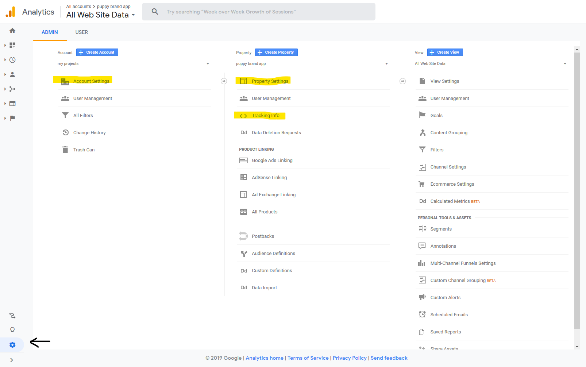
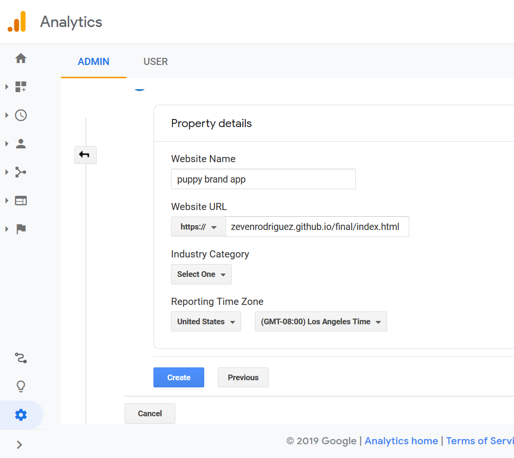
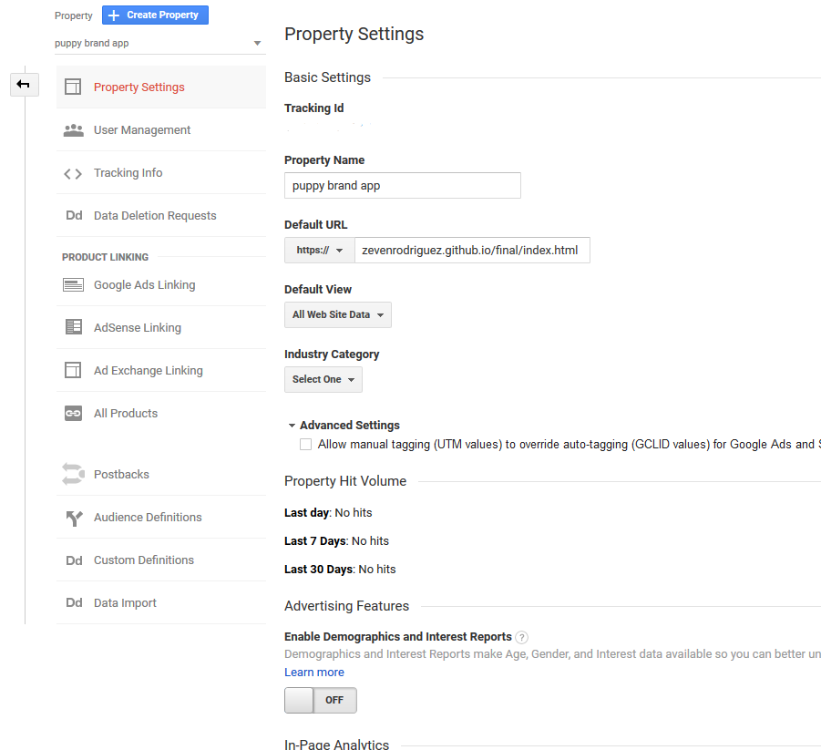
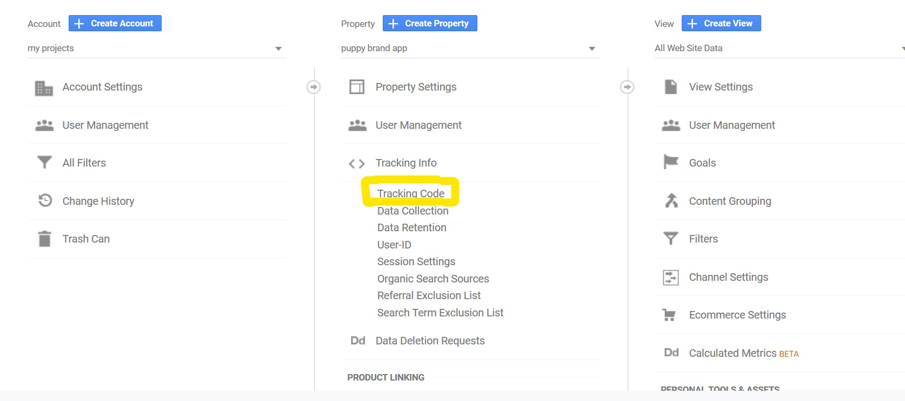
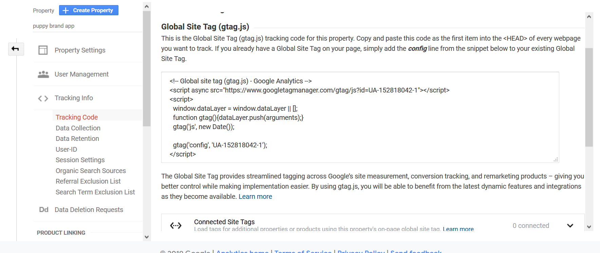

## What is SEO

Search engine optimization (SEO) is the process of affecting the online visibility of a website or a web page in a web search engine's unpaid results—often referred to as "natural", "organic", or "earned" results. In general, the earlier (or higher ranked on the search results page), and more frequently a website appears in the search results list, the more visitors it will receive from the search engine's users; these visitors can then be converted into customers.[*](https://en.wikipedia.org/wiki/Search_engine_optimization)

## How Search Engines Work

The two main functions search engines provide are:

1) Crawling the web and building an index
2) Providing search users with a ranked list of websites that they have determined are most relevant to the search entered.

What [this video](https://www.youtube.com/watch?v=LVV_93mBfSU) to better understand how what search engines do.

## Why Good HTML Matters

When you are writing HTML code, you are writing HTML for both the browser and search engines. *Semantic HTML* is the use of HTML markup to reinforce the semantics, or meaning, of the information in webpages and web applications rather than merely to define its presentation or look. A search engine will parse your HTML and know what the content is based on how you write your code. For example <nav>, <header>, <title>, <article>, <aside> and others are all meant to inform the machines reading your page what type of content is contained within the tags.

One of the most important elements for SEO is the title tag:

```HTML
<title>Great Dane - Site Name</title>
```

The title tag should inform search engines what this page is about. It's also what appears in search engine result links and our bookmarks.

The image below shows the site title and how it's used by Google.


The image below shows how the browser uses the title tag


While the title is by no means the only element a search engine considers into its ranking formula, it does carry some weight.

#### How search engines rank importance

How search engines rank search results is a closely guarded secret, but it's common knowledge that correct use of semantic HTML does help in SEO rankings. This is most evident in header tags:

# h1 Most important
## h2 Second most important
### h3 Third most important
#### h4 fourth most important
##### and so on....

The most important keywords should be in the title and article heading (h1). There should only be one heading per page.

## Why Good Content Matters

More important than good HTML is having relevant content. Search engines have worked hard to get you the best and freshest content. Nothing beats having good content that's regularly updated.

## Why create ad campaigns to promote your websites

[Twitter](https://ads.twitter.com/), [Facebook](https://www.facebook.com/business/), [Google Adwords](https://adwords.google.com) allow you to create ad campaigns to target users to promote your site, tweet, page, sell a product, or service. This process involves creating a campaign/ads that allows you to target based location, keywords, demographics, etc. These companies allow you place a bid, create a budget, or determine a length of time for your campaign and give you a assessment of your reach to potential viewers.

## Adding Google Analytics.

Analytics is a great resource to see who is visiting your site. Analytics are used throughout the industry to research everything from geographically who is visiting your site, what browsers are being used, what information/page are people most navigating to, etc. Analytics are valuable to be able to make informed decisions on what to potentially invest time and money on your site.

##### To add Google Analytics
* Visit https://analytics.google.com
 * You can use your existing google account or create a new one
   * If you login to the site for the first time it will direct you to create a new property, set property settings, and allow you to get your tracking info.
* Once you create property you can click, on the admin panel and edit your property, settings, and get your tracking info.


 * If you need to create an new property or edit you need to include the following information:
   * Website Name
   * URL (Your github.io site)
   * Category
   * Time Zone
* Make sure to save your changes

 * Click on property settings will also reflect the information in the Property Details Panel

 * Click on Tracking Info, then Tracking code.

 * Copy the script tag under the section labeled Website Tracking
 * Paste the code in your project index.html file right before the body tag.

